---

title: Djiango项目实战
date: 2020-06-16
tags:
 - Windows
 - 计算机
 - Djiango
categories:
 - technical
 - 技术笔记
 - Python

---


# 2020.4.17 - 4.19

万能的方法

```
# 查询某一个类的全部属性和方法
print(dir(object))
# 查看函数或模块用途的详细说明
help(object)
# 查看具体类中某方法的详细说明
help(object.method_name)
```

## 当前项目的开发环境

- python版本：Python 3.6.10 
- Django版本：2.2.10
- 利用的模板：
  - 后台是Amazon UI后台
  - 前台为Bootstrap4网上书店模板书店商城，Koparion
- 假如创建好项目无法运行
  - 找到run/debug configurations 
  - 在parametes 内写入 runserver


## 项目的结构搭建

- 1.创建项目，到一个xjq_django 下执行 django-admin startproject bookshop
- 2. 创建static文件夹，用于存放静态文件(html页面所需要的css和js)
- 3.在bookshop文件夹下创建两个个app 执行 
  
    - python manage.py startapp myhome    前台
    - python manage.py startapp myadmin   后台
- 4.配置bookshop 内的settings
  
    - INSTALLED_APPS（安装app） 内加入新创建的  myhome 和 myadmin 两个app
    
    - 配置TEMOLATES模板文件的读取路径
    
    - ```python
        [os.path.join(BASE_DIR, 'templates')]
        ```
    
    - 数据库的配置（下面为mysql的配置）
        - 配置好打开数据库的名字（bookshop）
        - 登录数据库的操作用户（root）
        - 登录数据库的操作用户的密码（空）
        - 数据库端口号默认是3306
        
    - 再打开cmd，mysql内创建一个名叫bookshop的数据库
        - 1.进入mysql mysql -u root -p
        - 2.创建数据库 create database bookshop default charset=utf8mb4;
        - 相关mysql操作可以到桌面上的mysql相关进行复习
- 5. 配置时区和语言
    - 设置语言 zh-Hans 为中文 en-us 为英文
    - LANGUAGE_CODE = 'zh-Hans'
    - 设置时区 亚洲上海
    - TIME_ZONE = 'Asia/Shanghai'
  
- 6.在templates模板文件价和static静态文件夹内都创建爱你myadmin和myhome两个文件
  
- 因为前后台用的模板不一样，所以前后台运用的css和jss也不一样
  
- 7.在static内创建一个upload文件夹，用于存放前后台都需要的图片存放
- 至此，基本文件目录创建完成

------


## 前台页面和后台页面的基本搭建

- 把前台后后台用到的模板和模板所需的静态文件，分别拷贝到对应的templates和static文件夹中的不同分类中
- 利用替换将原来的assets/


-  修改为/static/myadmin
- 前台也是如此，这样页面的基本搭建就完成了

## 后台开发

- 功能

  - 注册

  - 会员管理

    - 查看会员列表，查看详细信息，禁用，修改，删除，添加（正常网站都无删数据的功能）（数据对于公司来说是无价滴），用禁用来代替

  - 图书分类（暂时不做）

  - 图书商品

  - 订单详情

  - 权限管理

    ------

    

## 会员管理页面的搭建

- 视图里面添加对对应的函数

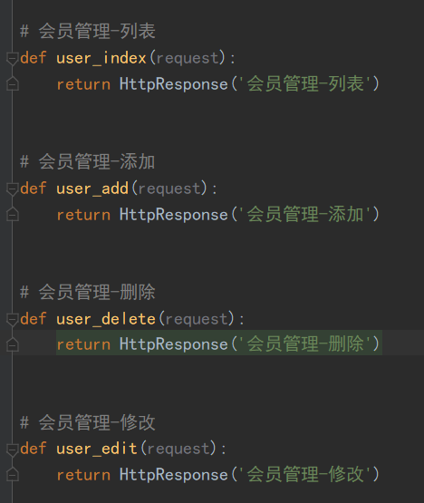

- 路由里面添加对应的路由

- 利用反向解析路由，来配置index.html内的a链接的值

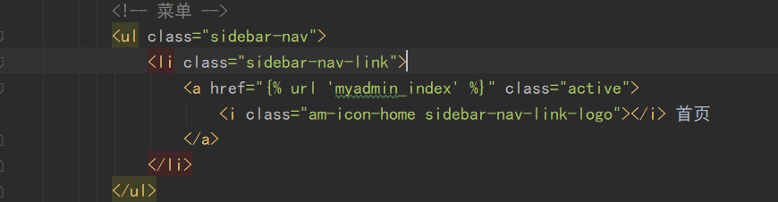

```
- htm内属性的值必须在引号内， 
- 反向解析固定写法****
- <i> 标签显示斜体文本效果。
- 标签<ul>定义无序列表 
```


------

- 在templates文件夹内创建，一个users文件夹，里面存放关于用户的页面模板
- users内的index页面是继承了myadmin后台文件的index.html页面

```txt
# 继承某个页面


# 重写html里的某个代码块,block包裹， con，为包裹内容的name

	中间为想要重写的html代码

```

- 重写会员管理的模块内容，其余的和首页无差别。

- python 格式化代码 
  - Ctrl + Alt + L 

## 后台添加页面和模型的设计

- ***快捷键缩进 Tab， 缩退，shift+Tab***

### 用户模型的建立与构想

| 列名         | 字段(属性名) | 类型（在数据库中的存储形式） | 说明             |
| :----------- | :----------- | ---------------------------- | ---------------- |
| ID           | id           | 主键                         |                  |
| 用户名       | User_name    | Varchar                      |                  |
| 密码         | Pass_word    | char(80)[需要用到加密]       |                  |
| 手机号       | Phone        | char(11)                     | 唯一索引         |
| 性别         | Sex          | Tinyint                      |                  |
| 年龄         | Age          | Tinyint                      |                  |
| 注册时间     | Add_time     | Datetime                     |                  |
| 最后登录时间 | Save_time    | Datetime                     |                  |
| 状态         | Status       | Tinyint                      | 默认为0，禁用为1 |
| 头像         | Face_url     | Varchar                      | 存储头像的路径   |


## 模型的设计（简称数据库的设计）

https://docs.djangoproject.com/zh-hans/2.2/ref/models/fields/#datetimefield

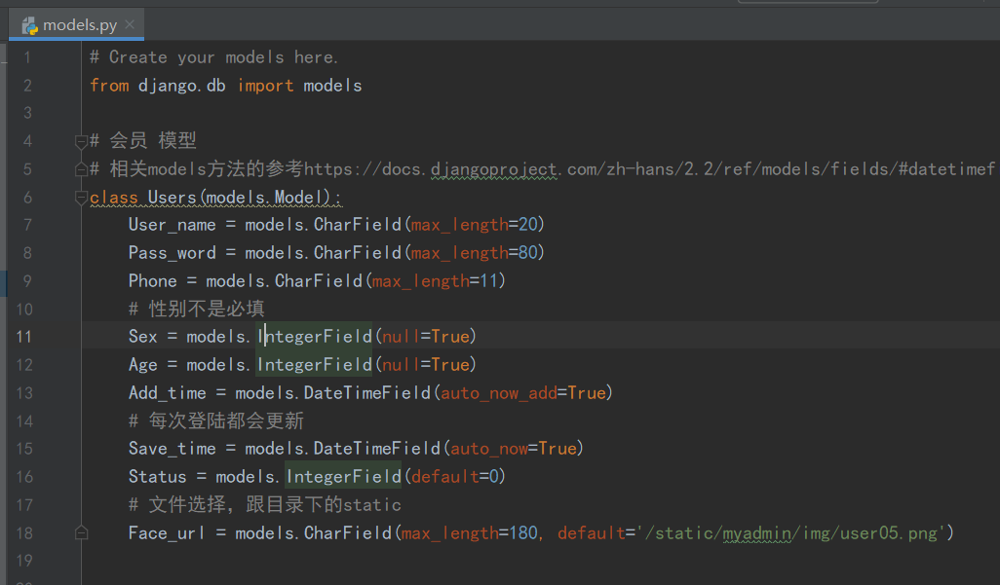

模型设计好后，进行数据库的迁移

## 数据库的迁移

- 1.在bookshop项目文件路径内
  - 执行迁移准备
  - python manage.py makemigrations
- 2、再执行迁移操作
  - python manage.py migrate
  - 要在当前项目bookshop下执行

## 创建一个表单from来接收web发来的数据

-  表单能接收当前web页面的信息然后再提交给后台进行处理

- 想要表单能够接收图片，from里面方法必须为post，且有enctyppe
  - from表单必须要写明提交给哪个网页，然后由那个网页的后台views来进行逻辑处理
  -  action="

- 由于是post提交，还需要手动加上csrf_token验证

  - ```html
    <form action="" class="am-form tpl-form-line-form" method="post" enctype="multipart/form-data">
     
    ```

- 至此，from表单内的数据才可以提交到另一个网站上去，也可以提交给当前页面的后台进行处理，这里就是提交给当前页面的后台进行处理数据

## 后台处理数据

### 接收web的数据进行处理

- 前提：请求方法为POST
- 后台逻辑：
  - 接收表单数据，数据为dict对象，并把认证的csrf弹出
  - 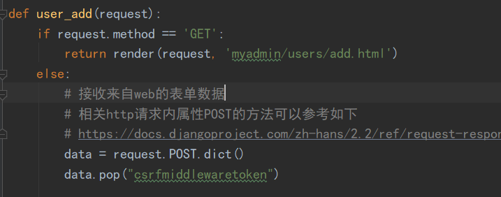
  - 对密码进行加密
  - 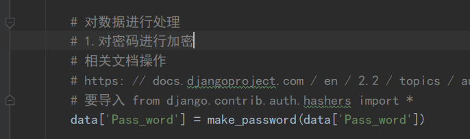
  - 判断是否有头像上传
  - 最后把数据存入数据库中，需要把models文件导入进去
  - 


# 2020.4.17 - 4.19

## 后台处理web上传的图片

- https://docs.djangoproject.com/zh-hans/2.2/ref/request-response/#attributes

- 参考网站，处理的是请求对象中的文件属性

### 上传的文件需要改名

- 防止不同的人上传同一个名字的文件，在数据库中造成覆盖

- 实现逻辑

  - 先从web端拿到文件，利用.name.split分割为list，pop出文件的类型
  - 判断是否为规定图片的类型
  - 定义存储图片的名字，利用随机数的产生来命名，进行字符串相加
  - 打开当前文件的根目录下，将文件写入到服务器电脑上的目录下
  - 再把该文件的路径给存入数据库中
  - 

- ```python
  a = '1,2,3'
  x = a.split(',').pop()
  print(x)
  # 剩下的是3
  a = '1,2,3'
  x = a.split(',')
  x.pop()
  print(x)
  # 剩下的是 1,2
  a = '1,2,3'
  x = a.split(',')
  print(x.pop())
  # 剩下的是 3
  
  
  pop()方法返回的是弹出的元素，默认弹出最后的一个元素
  ```

- 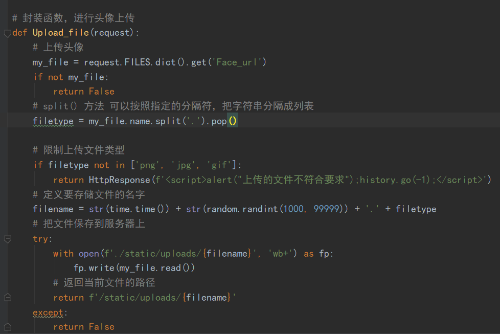

## 上传图片的预加载

- 在web中暂时显示要上传的图片
- 实现技术
  - JavaScript脚本语言实现
  - 

- 实现逻辑
  - 获得当前<input> 标签的控制权，给他绑定一个事件函数
  - 判断是否选择了图片
    - 否：获得 标签控制权，设置src属性为空
    - 是：获取当前用户选择的图片的对象，然后将对象的值赋予img标签的src

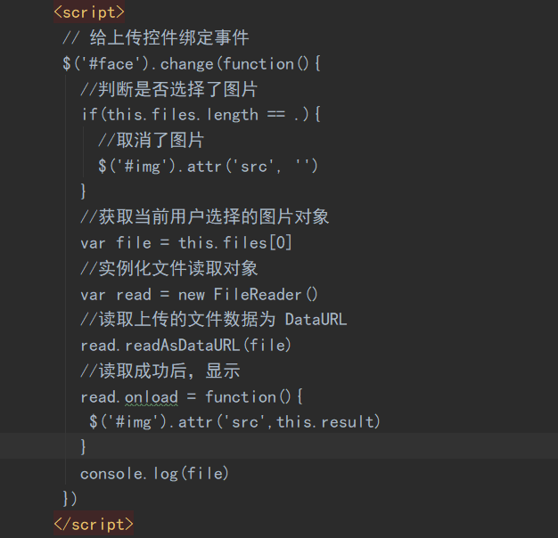


# 2020.4.27 - 5.1

## 后台显示数据库中的数据

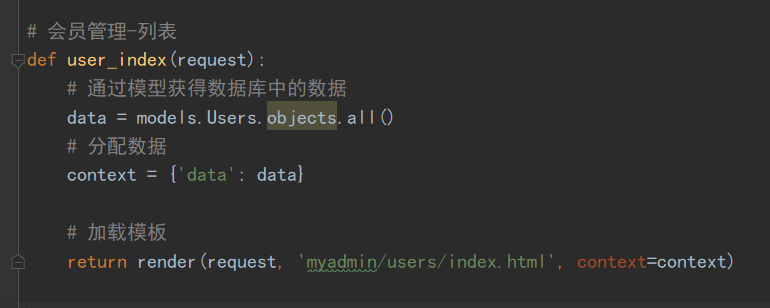

- 逻辑：
  - 导入模板类 from . import models
  - 得到数据
  - 分配数据
- 加载入模板
  
- 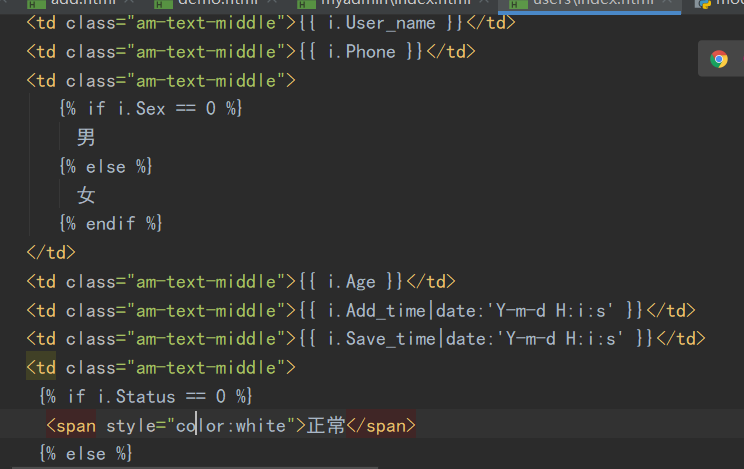

- 在html网页中使用数据需要在两个大括号内进行
- 而代码则是需要一个大括号加一个%


## 利用ajax完成不跳转删除

​    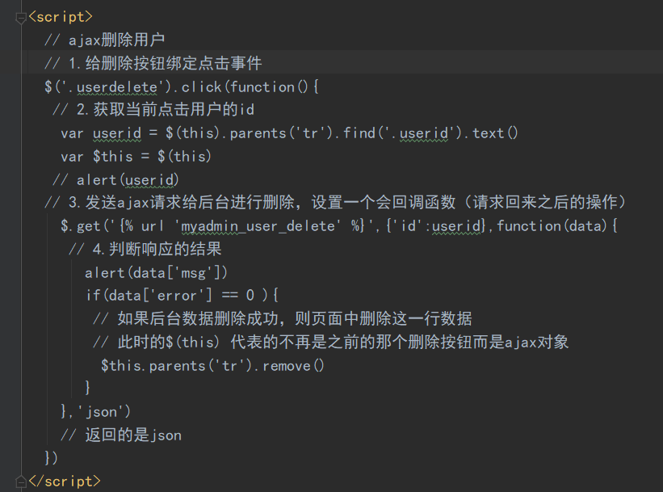

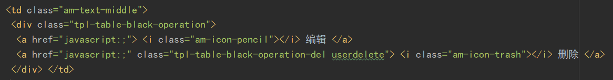

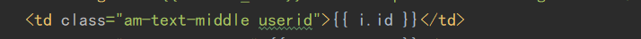


# 2020.5.21-30

## 对数据库进行搜索数据

```python
select_type = request.GET.get('select_type', None)
key_words = request.GET.get('key_words', None)
if select_type:
    # 当搜索条件不为空
    if select_type == 'all':
        from django.db.models import Q
        # 参考文档
        # https://docs.djangoproject.com/zh-hans/2.2/topics/db/queries/#complex-lookups-with-q-objects
        data = data.filter(
            Q(id__contains=key_words)
            | Q(User_name__contains=key_words)
            | Q(Phone__contains=key_words)
        )
        # select * from users where id like '%keywords%' or username like '%keywords%' or Phone like '%keywords%'
       # return HttpResponse(f'<script> alert("依据全部搜索");history.go(-1) </script>')
    else:
        search = {f'{select_type}__contains': key_words}
        data = data.filter(**search)
       # return HttpResponse(f'<script> alert("其余"); history.go(-1) </script>')

# 分配数据
context = {'data': data}
# 加载模板
return render(request, 'myadmin/users/index.html', context=context)
```

函数传参前面加两个**代表，以 v1=k1,v2=k2,v3=k3....这么传进去


## 将数据库中的数据进行分页处理

```python
"""分页功能"""
# 参考文档https://docs.djangoproject.com/zh-hans/2.2/topics/pagination/
from django.core.paginator import Paginator
# 实例分页对象，传入数据，以及要分几页
data = models.Users.objects.all()
p = Paginator(data, 5)
# 获取当前页码,默认为1
page_index = request.GET.get('page', 1)
# 根据页码获得当前页的数据
data = p.page(page_index)

# 分配数据
context = {'data': data}
# 加载模板
return render(request, 'myadmin/users/index.html', context=context)
```


## 分页优化

- 分页优化要借助下面的模板自定义标签
- 在应用中创建一个文件，在文件中写入内容，自己定义需要的功能函数
- 第一个文件是复制该应用下的同名文件，第二个pagetag.py 是自己写的
- 作用：能在html页面中，使用函数

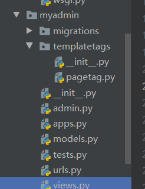


## 在模板中自定义标签

- 也就是pagetag.py 内的代码，
- 实现了分页优化。

```python
from django import template
from django.utils.html import format_html
register = template.Library()


# 自定义过滤器
@register.filter
def xjq_upper(val):
    return val.upper()


@register.simple_tag
def jia(a, b):
    return int(a) + int(b)


# 自定义分页页码的显示的标签
@register.simple_tag
def show_page(total_page, request):
    # 要求，显示的页码数不能超过十个

    # 定义开头显示的页码和结尾显示的页码
    page_now = request.GET.get('page', 1)
    page_now = int(page_now)
    start = page_now-5
    end = page_now+5

    # 判断，当前页面处于左右两边的临界区域
    if page_now < 6:
        start = 1
        end = 10
    if page_now > total_page-4:
        start = total_page-9
        end = total_page
    if total_page <= 10:
        start = 1
        end = total_page

    page_html = ''
    page_html += f'<li><a href="?page={1}">首页</a></li>'
    if page_now-1 < 1:
        page_html += f'<li class="am-disabled"><a href="?page={page_now - 1}">上一页</a></li>'
    else:
        page_html += f'<li><a href="?page={page_now-1}">上一页</a></li>'
    for i in range(start, end+1):
        # 如果是当前页，需要高亮
        if i == page_now:
            page_html += f'<li class="am-active" ><a href="?page={i}">{i}</a></li>'
        else:
            page_html += f'<li><a href="?page={i}">{i}</a></li>'

    if page_now + 1 > total_page:
        page_html += f'<li class="am-disabled"><a href="?page={page_now + 1}">下一页</a></li>'
    else:
        page_html += f'<li><a href="?page={page_now + 1}">下一页</a></li>'
    page_html += f'<li><a href="?page={total_page}">尾页</a></li>'
    return format_html(page_html)
```

- 在html页面中使用我们自己写的函数
- 
- 

```
            
<!-- <li class="am-disabled"><a href="#">«</a></li> -->
            
<!-- <li class="am-active"><a href="#">1</a></li> -->
```


# 2020.5.31-6.2

## 图书分类模块的设计

-  图书拥有的操作
  - 添加，列表显示，删除，编辑
- 图书分类模型：

| 列名     | 字段      | 类型   | 说明 |
| -------- | --------- | ------ | ---- |
| ID       | id        | 主键   |      |
| 分类名称 | Book_name | 字符串 |      |
| 父级ID   | Book_pid  | 数字   |      |
| 路径     | Book_path | 字符串 |      |

```
分类
ID	分类名		父级ID	路径path	
1	人文社科	0		0，
2	小说		 0			0，
3	经济管理	0		0，
4	古籍		 1			0,1，
5	古经		 4			0,1,4
6	当代小说	2		0,2 
```

```
# 图书分类模型
class BookType(models.Model):
    Book_name = models.CharField(max_length=10)
    Book_pid = models.IntegerField()
    Book_path = models.CharField(max_length=50)
```

## 数据库的迁移

- 1.在bookshop项目文件路径内
  - 执行迁移准备
  - python manage.py makemigrations
- 2、再执行迁移操作
  - python manage.py migrate
  - 要在当前项目bookshop下执行

## 对myadmin后台视图进行优化

- 1.在myadmin应用文件下创建views文件夹
- 2.把views文件夹变成一个包，需要有____init____.py这个文件
  - 需要把views下的所有.py文件的名字都写入初始化文件中
- 3.对于处理不同模型的视图函数，建立不同的专属文件来处理

### 修改后的文件目录

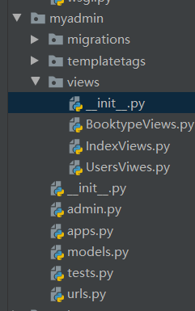

- init文件的内容

```

__all__ = [
    'IndexViews',
    'BooktypeViews',
    'UsersViwes',
]
```

- 更改后的myadmin文件夹下的urls.py文件内容需要进行改变
- 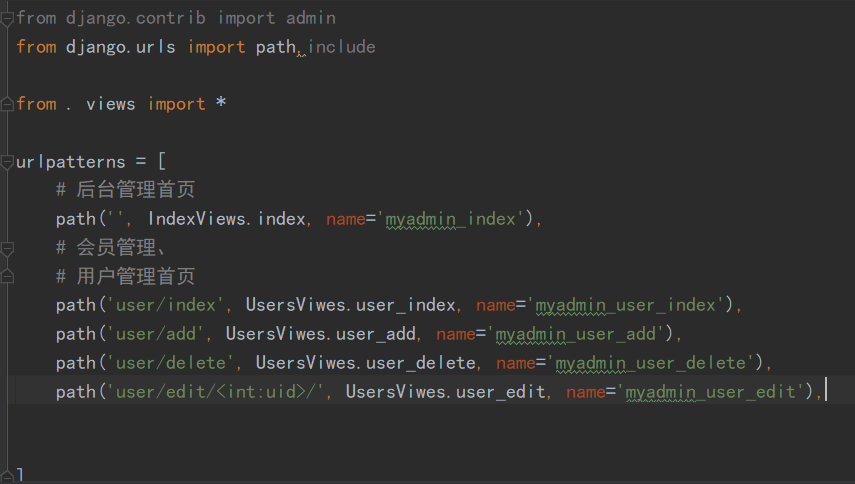


## 对图书分类进行初始化操作

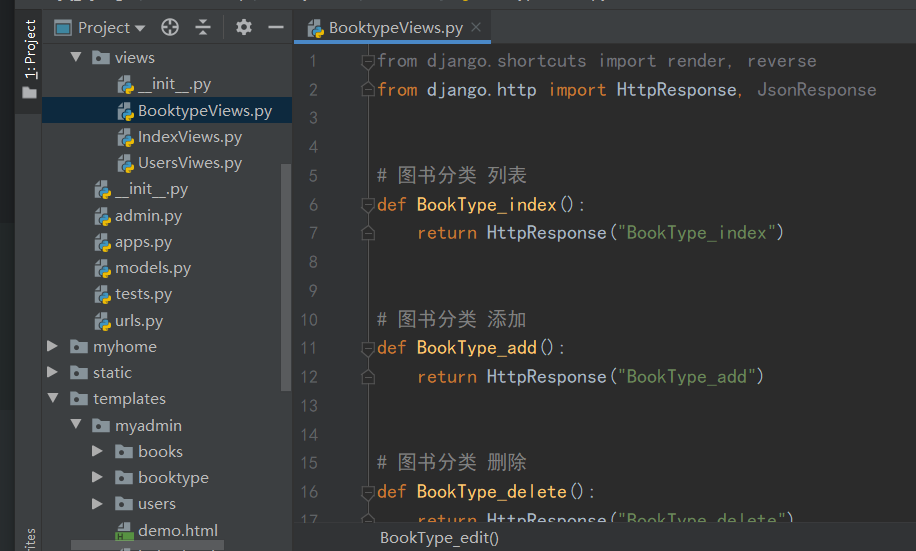

- 书写基本的http响应

- 在urls中添加相应的路由

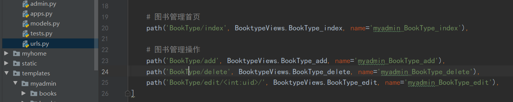

- 
- ***在myadmin的index.html中修改a链接的跳转网址

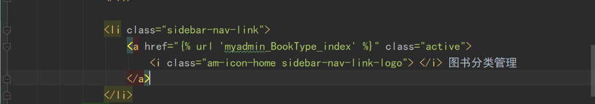


## 图书分类添加的实现

-  图书分类存在所属关系，父级，子集存在着关联
- 下面是完成对添加网络请求的操作

```python
def BookType_add(request):
    types = models.BookType.objects.all()
    context = {'types': types}
    if request.method == 'GET':
        return render(request, 'myadmin/booktype/add.html', context=context)
    else:
        # 接收表单数据
        data = request.POST.dict()
        data.pop("csrfmiddlewaretoken")
        # {'Book_pid': '1', 'Book_name': '玄幻'}
        # 判断当前添加的分类是否为顶级分类
        if data['Book_pid'] == '0':
            data['Book_path'] = '0,'
        else:
            # {'Book_pid': '2', 'Book_name': '修仙'}
            # path 是父级的path数据加上当前的父级Book_pid
            # 获取父级对象
            obj = types.get(id=data['Book_pid'])
            data['Book_path'] = obj.Book_path + data['Book_pid']+','
            # {'Book_pid': '1', 'Book_name': '斗破苍穹', 'Book_path': '0,1,'}
    # 进行数据的添加
    try:
        obj = models.BookType(**data)
        obj.save()
        url = reverse('myadmin_BookType_index')
        # /admin/BookType/index
        return HttpResponse(f'<script>alert("图书分类添加成功");location.href="{url}"</script>')
    except:
        return HttpResponse(f'<script>alert("图书分类添加失败");history.back();"</script>')

    return HttpResponse("BookType_add")
```

- 关键是如下逻辑

  ```python
  # 获取父级对象
  # path 是父级的path数据加上当前的父级Book_pid
  obj = types.get(id=data['Book_pid'])
  data['Book_path'] = obj.Book_path + data['Book_pid']+','
  ```

  

## 对数据库内的层级关系进行排序显示

- 对应视频235

- 原来的显示如下
- 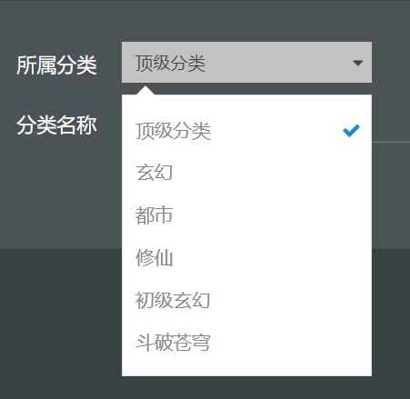

- 正确的应该是玄幻下面是初级玄幻，以及斗破苍穹

- 出现上图现象原因是，python语句

```
    data = models.BookType.objects.all()
    # 这条语句，相当于在mysql中执行
    # select * from myadmin_booktype;
```

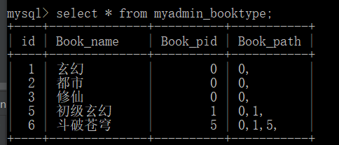


- 对数据库进行操作
- 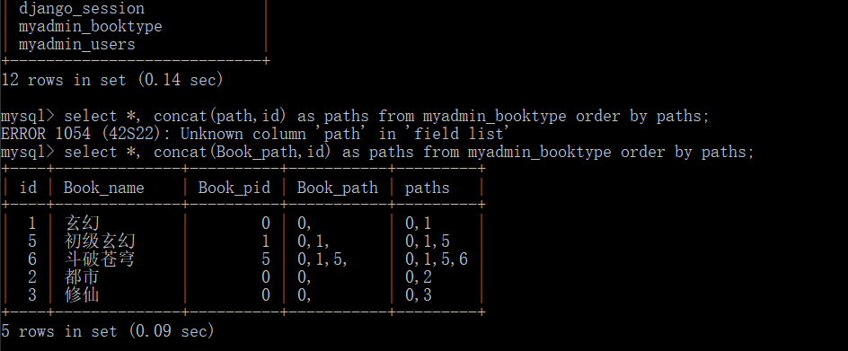

- mysql执行语句

```
 # concat函数可以拼接两个字段，合为一个字符串，新别名为paths, 然后以这个新的别名来进行从小到大的排序
 # mysql中排序是按照ascall码进行排序的，所以第一列是最小，第二列是1.依次增大
 select *, concat(Book_path,id) as paths from myadmin_booktype order by paths;
```

- 现在思考的问题就是如何把mysql的这条语句用python进行执行

```
 # select * from myadmin_booktype;
    # data = models.BookType.objects.all()
    # select *, contcat(Book_path,id) as paths from myadmin_booktype order by paths;
    data = models.BookType.objects.extra(select{'paths':'concat(Book_path,id)'}).order_by('paths')
    context = {'data': data}
    return render(request, 'myadmin/booktype/index.html', context=context)
```

### 处理缩进问题

- 让刚才已经分好类的内容进行不同程度的缩进
- 这样增加可读性
- 逻辑
  - 根据不同类型的路线Book_path 中包含的逗号作为缩进的依据
  - 每一个类型的缩进个数为逗号个数-1

```
  for i in data:
        # print(type(i), i)
        # <class 'myadmin.models.BookType'> BookType object (1)
        num = i.Book_path.count(',')-1
        i.nbsp = '|----' * num
```


## ajax删除分类

- 视频236

- 删除逻辑
- 可以删除的类型满足的条件
  - 该类型下没有子类
  - 该类型下没有商品存在

```
def BookType_delete(request):
    # 获取要删除的分离的id
    id = request.GET.get('id')
    # 判断当前类下是否含有子类
    num = models.BookType.objects.filter(Book_pid=id).count()
    if num:
        return JsonResponse({'error': 1, 'msg': '该类下含有子类，不能删除'})

    # 判断该类下是否含有商品

    # 执行删除
    try:
        obj = models.BookType.objects.get(id=id)
        obj.delete()
        return JsonResponse({'error': 0, 'msg': '删除成功'})
    except:
        return JsonResponse({'error': 3, 'msg': '删除失败'})

```

## ajax编辑图书分离

### script代码语法出错不会报

- 所有的javascript代码都会失效
- django 中所有的post请求都需要通过CSRF验证

- 双击文字，让他变成一个input类型的标签，可以直接在页面对类型进行更改

```
// ajax编辑分类名称
// type_name 所属span标签 $(this)是一个jQuery对象
$('.type_name').dblclick(function(){
           // 解决多次点击双击仍有效的bug
           // 利用上锁开锁原理，保证同一时间内只能触发一次，标签可编辑
           is = $(this).attr('isclick')
           // 1.检测是否上锁
           if(is == '0'){
            // 没上锁, 对当前标签进行编辑操作
                edit_type_name($(this))
           }
})

function edit_type_name($this){
// 此时的$this 变量已经是一个jQuery对象,对应着span标签
	// 进入函数后首先上锁
	$this.attr('isclick','1')
 // 1.绑定双击事件，获取当前的分类名称
	var name = $this.text()
	var id = $this.parents('tr').find('.book_id').text()
   //alert(name)
   // 2.创建一个input输入框，把name放进去
   var inp = $('<input value="'+name+'" style="color:black">')
   // 3.把input放置到显示的位置
   $this.html(inp)
   // 自动全选内容
   inp.select()
   // 4. 给input绑定丧失焦点事件
   inp.blur(function(){
   // 这里的$(this）对应着input标签
		// 5.丧失焦点后，获取更新后的name
		var new_name = $(this).val()
		// alert(new_name)
		// 6.判断新的name是否发生了变化
		if(new_name == name){
			// 没变化，还原即可
			 $this.html(name)
		}else{
			// 7.发送ajax请求去后台，更新分类的Book_name
			// $.post()参数：
			// 1.提交的地址,
			// 2.post请求提交的表单数据（以字典的形式传过去），
			// 3.回调函数function,参数：接收视图函数发来的数据
			// 4.回调接收的返回数据类型

			// django 中所有的post请求都需要通过CSRF验证
			$.ajaxSetup({
				data:{csrfmiddlewaretoken: '{{ csrf_token }}'}
			})
			$.post('',{'id':id, 'name': new_name}, function(data){
				//alert(data['msg'])
				// 8. 判断是否更新成功
				if(data['error']==0){
				   // 9.显示新的名字
				   $this.html(new_name)
				}else{
					$this.html(name)
				}
			}, 'json')
		}
		// 当丧失焦点后解锁
		$this.attr('isclick', '0')
	})
}
```

- 这里面运用到了解锁，

  ### 上锁问题解锁开锁问题

  - 初始状态设为开锁

  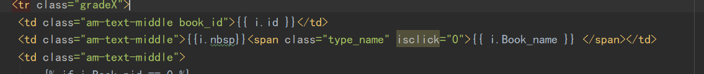

  - 每次双击进行判断，查看当前状态是否为上锁，不上锁，才能执行ajax不跳转编辑操作

    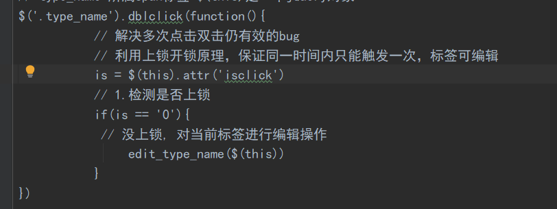

  - 每次进入编辑操作时，先上锁，防止二次操作

    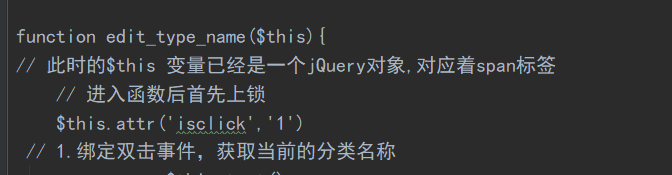

  - 每次对一个标签操作完后，再进行解锁

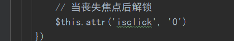


# 2020.6.2 - 

## 图书商城模型设计

## 图书商品拥有的功能

- 添加，删除，修改，列表显示

## 图书模型设计：

- 一个分类标签对应多本书，一对多

| 列名         | 字段名      | 类型                 | 说明 |
| ------------ | ----------- | -------------------- | ---- |
| id           | id          | 主键                 |      |
| 所属分类     | Type_belong | 一对多               |      |
| 书名         | Title       | models.CharField     |      |
| 推荐语       | Tuijian     | models.CharField     |      |
| 作者         | Author      | models.CharField     |      |
| 出版社       | Publisher   | models.CharField     |      |
| 出版时间     | Pub_date    | models.DateTimeField |      |
| 定价         | Price       | models.IntegerField  |      |
| 库存数量     | Num         | models.IntegerField  |      |
| 国际书号ISBN | Isbn        | models.CharField     |      |
| 详情介绍     | Context     | models.CharField     |      |

```

# 图书商品模型
class Books(models.Model):
    # 一对多，参数：当前类1对多的对象， 级联删除
    # 主外关系键中，级联删除，也就是当删除主表的数据时候从表中的数据也随着一起删除
    Type_belong = models.ForeignKey('BookType', on_delete=models.CASCADE)
    Title = models.CharField(max_length=255)
    Tuijian = models.CharField(max_length=255)
    Author = models.CharField(max_length=50)
    # 出版社
    Publisher = models.CharField(max_length=100)
    # 出版时间
    Pub_date = models.DateTimeField()
    Price = models.IntegerField()
    # 库存
    Num = models.IntegerField(default=10)
    Isbn = models.CharField(max_length=13)
    # 详情
    Context = models.TextField()
```

## 图书封面图集模型

| 列名      | 字段         | 类型             |
| --------- | ------------ | ---------------- |
| 所属图书  | Book_belong  | 一对多           |
| 封面图url | Book_img_url | models.CharField |
|           |              |                  |

```
# 图书封面图集
class BookImgs(models.Model):
    Book_belong = models.ForeignKey('Books', on_delete=models.CASCADE)
    Book_img_url = models.CharField(max_length=100)

```

- 设计好模型后
- 生成迁移文件
  - 在bookshop目录下执行 python manage.py makemigrations

- 执行迁移文件
  - python manage.py migrate

订单，

权限管理

## 图书商品的添加

- 注意
  - 模型里有一对多的关系，所以那个属性应该对应着一个对象，而网页传来的是对象的id

```
def Books_add(request):
    if request.method == 'GET':
        context = {'types': select_all_types()}
        return render(request, 'myadmin/books/add.html', context=context)
    else:
        # 接收表单数据
        data = request.POST.dict()
        data.pop('csrfmiddlewaretoken')
        # 检测是否上传了图书封面
        if not request.FILES.get('Img_url', None):
            return HttpResponse(f'<script>alert("至少上传一张图片");history.back();</script>')
        try:
            # 添加图书对象
            data['Type_belong'] = models.BookType.objects.get(id=data['Type_belong'])
            book_obj = models.Books(**data)
            book_obj.save()
        except:
            return HttpResponse(f'<script>alert("图书上传失败");history.back();</script>')

        try:
            # 图书封面图的处理
            img_obj = models.BookImgs()
            # 一个图书有多个图书封面
            img_obj.Book_belong = book_obj
            img_obj.Book_img_url = Upload_file(request, 'Img_url')
            img_obj.save()
            print(data)
        except:
            book_obj.delete()
            return HttpResponse(f'<script>alert("图书封面上传失败");history.back();</script>')

        url = reverse('myadmin_Books_index')
        return HttpResponse(f'<script>alert("添加成功");location.href="{url}" </script>')
```

## 图书列表的显示

- 注意！：图书图片的显示比较特殊

```
def Books_index(request):
    # 接收数据
    data = models.Books.objects.all()
    # 访问关联对象参考
    # https: // docs.djangoproject.com / zh - hans / 2.2 / ref / models / relations /
    # print(data[0].bookimgs_set.first())
    context = {'data': data}
    return render(request, 'myadmin/books/index.html', context=context)
```

```
<td>  </td>
```

- Html中函数不能加括号()

```
# print(data[0].bookimgs_set.first().Book_img_url)
src="{{ i.bookimgs_set.first.Book_img_url }}"
```

## 添加富文本编辑器

把ueditor作为项目中的应用，加入到项目中去

- 作为一个APP ，和myadmin文件夹同级
- 在setting文件中配置app应用的加入
- 修改根路由文件，配置富文本编辑器的路由地址
- 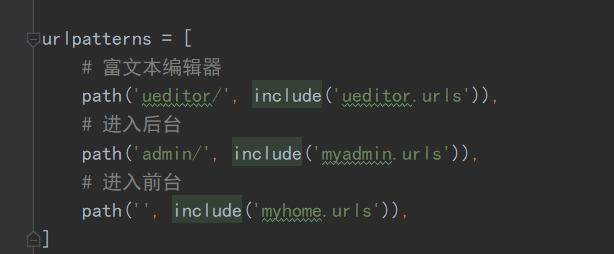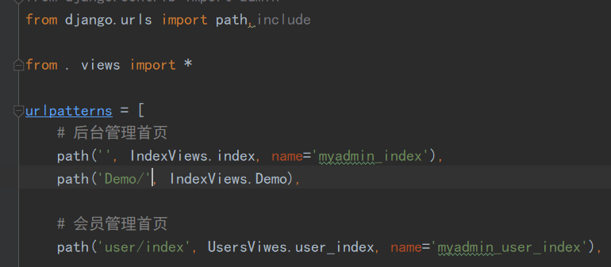

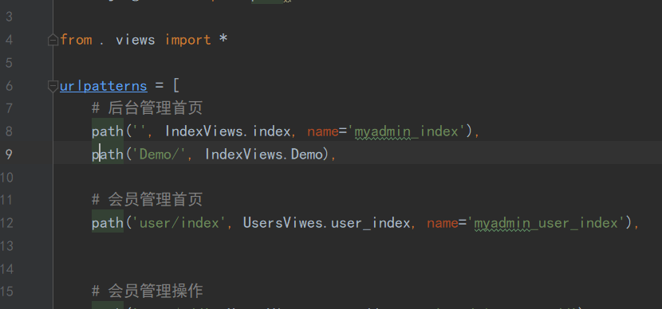

- 在templates下的myadmin下创建demo.html

- 参考网址 http://fex.baidu.com/ueditor/#start-submit

  css 会对富文本编辑器有影响

  采用二分法，删除css样式对


## 多图开发插插件应用

​	从jq22.com白嫖插件，全是html插件

- 视频243


